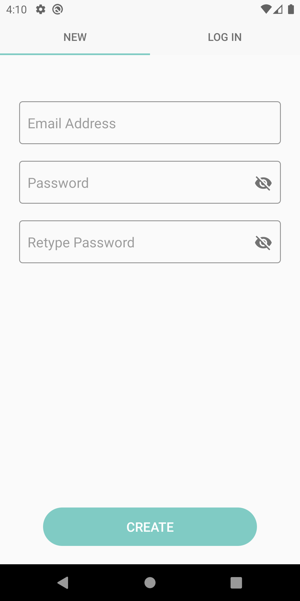
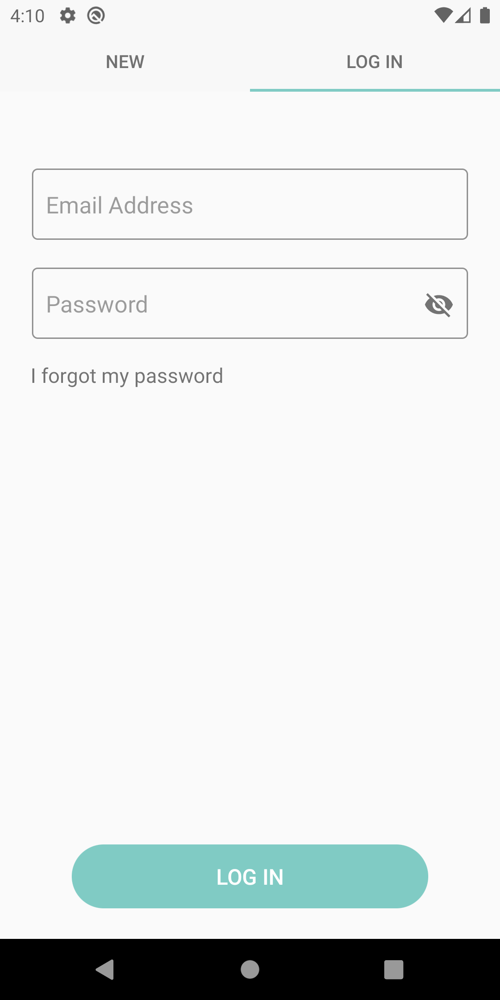
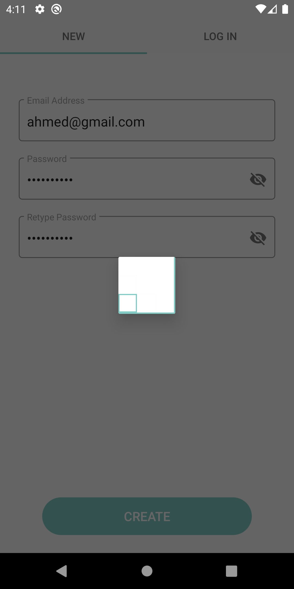
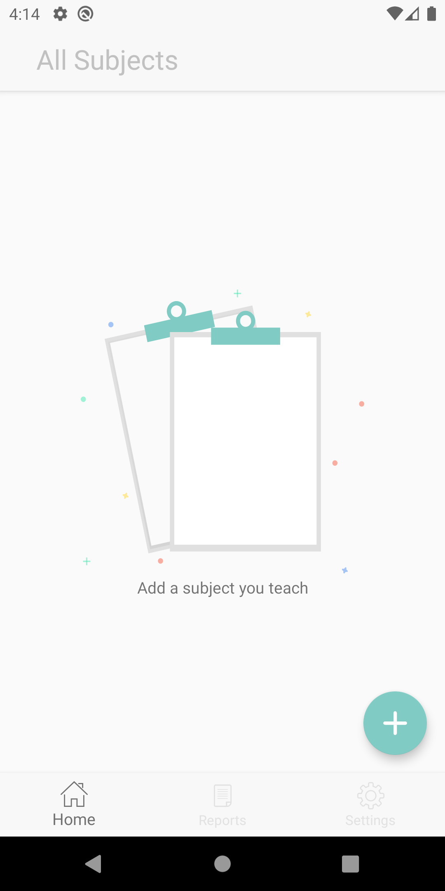
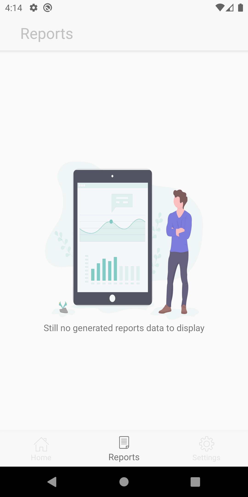
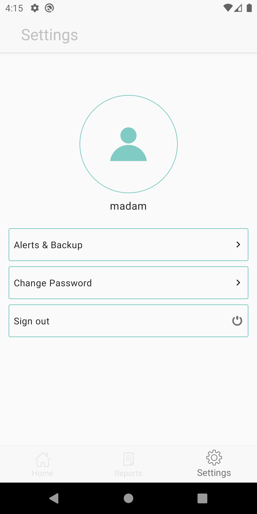
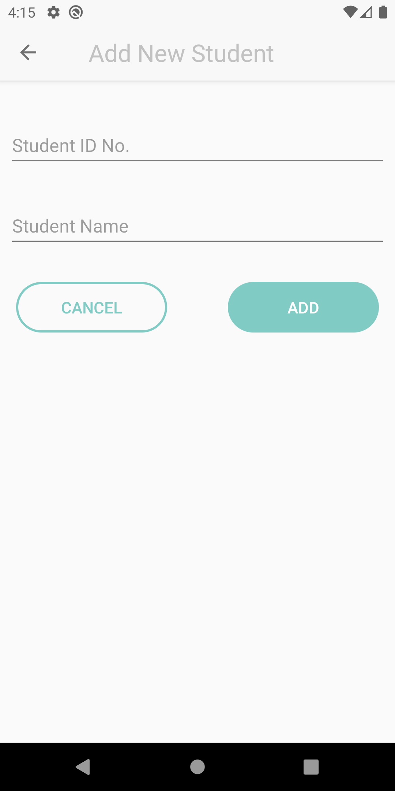

# Printless

A student attendance app help doctors to track and get reminder of students attendance.

# Features

* MVP architecture pattern.
* Cloud sync.
* Reminder to record attendance for specific classes.
* Weekly and monthly reports.
* Auto export and send warn emails to students with high attendance rate.

# Screenshots
<table>
  <tr>
    <td></td>
    <td></td>
     <td></td>
     <td></td>
  </tr>
  <tr>
    <td></td>
    <td></td>
    <td></td>
  </tr>
</table>

# Contribution

Fork this repo and feel free to edit and play in the code base.
